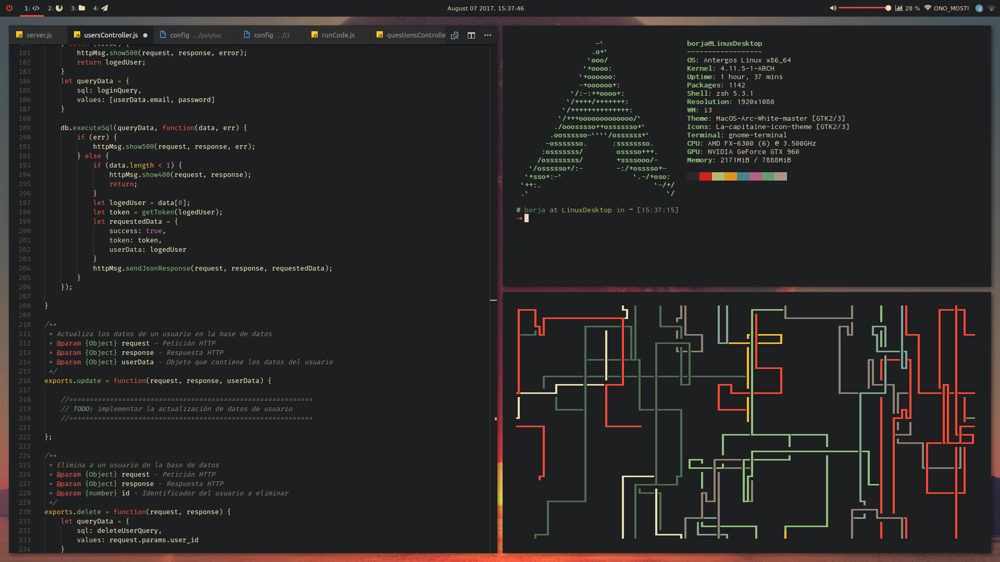
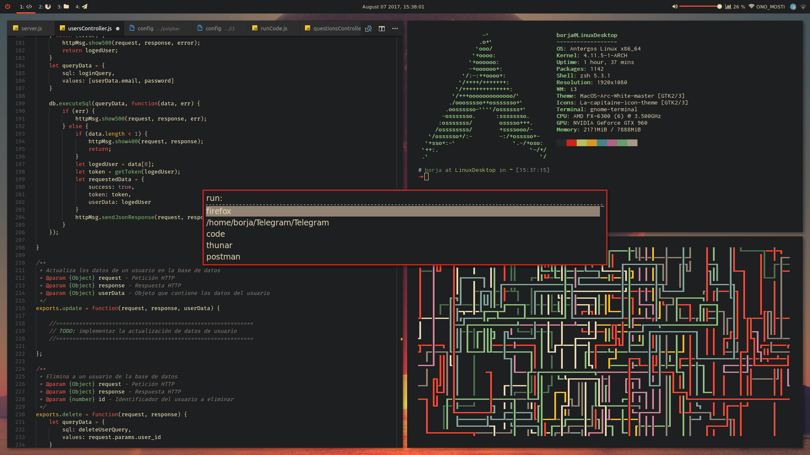
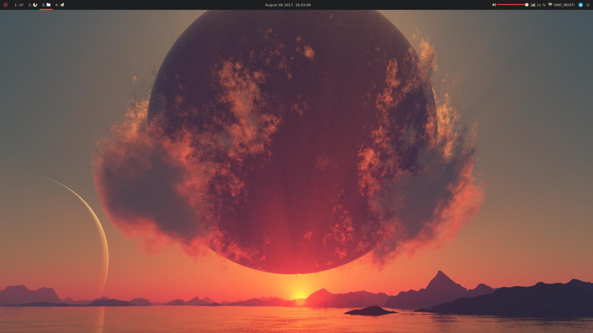

# Dotfiles

This are my dotfiles for my wm configuration

## Requisites

* [i3-gaps](https://github.com/Airblader/i3)
* [polybar](https://github.com/jaagr/polybar)
* [rofi](https://davedavenport.github.io/rofi/)
* [Visual Studio Code](https://code.visualstudio.com/)

## Screenshots

## Wallpaper

Wallpaper was taken from Wallhaven and can be found [here](https://wallpapers.wallhaven.cc/wallpapers/full/wallhaven-393777.jpg)
